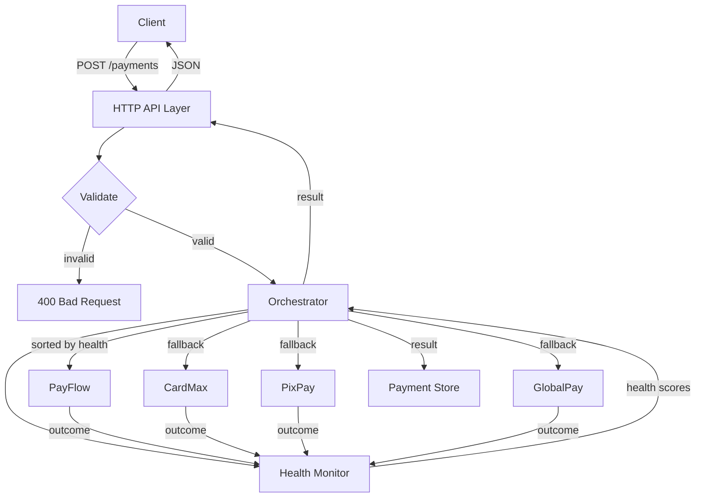
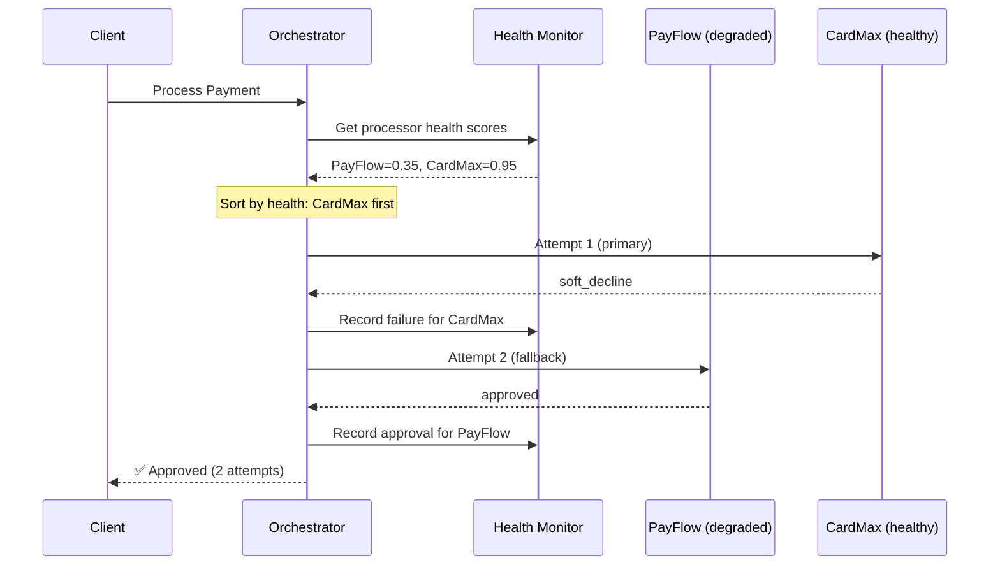
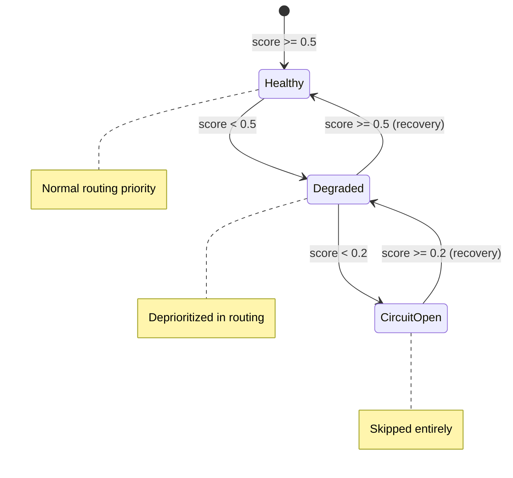

# Nimbus Payment Orchestrator


> Intelligent payment routing engine with automatic retry logic, health-based adaptive routing, and circuit breaker patterns for multi-processor payment orchestration in Latin America.

## Problem

Nimbus Rides' payment acceptance rate dropped from 87% to 61% because failed transactions weren't retried on alternative processors. This service solves that by intelligently routing payments through multiple processors with automatic fallback on retriable failures.

## Architecture



## Routing Strategy

### How Payments Are Routed

1. **Filter** processors by supported payment method
2. **Sort** eligible processors by health score (highest first)
3. **Skip** any processor with circuit breaker open (health < 0.2)
4. **Try** the healthiest processor first
5. **On retriable failure** (soft decline, processor error, timeout, rate limit) → try next processor
6. **On hard decline** (insufficient funds, fraud) → **STOP immediately** — never retry
7. **Max 3 attempts** across all processors



### Processors

| Processor | Approval Rate | Specialty | Payment Methods |
|-----------|:---:|-----------|-----------------|
| **PayFlow** | 70% | General purpose | card, pix, oxxo, pse |
| **CardMax** | 85% | Strong on cards | card, oxxo |
| **PixPay** | 90% PIX / 50% card | LATAM specialist | card, pix |
| **GlobalPay** | 75% flat | Universal fallback | card, pix, oxxo, pse |

### Health Monitoring



- **Sliding window**: Last 50 transactions OR last 10 minutes (whichever is smaller)
- **Health score**: `approvals / total` in window (0.0 to 1.0)
- **New processors**: Default to healthy (score 1.0) — don't penalize unknown processors

## Quick Start

### Prerequisites
- Go 1.24 or later

### Run

```bash
# Start the server
make run
# or
go run cmd/server/main.go
```

The server starts on `:8080` (override with `PORT` env var).

### Test

```bash
# Run all tests with race detector
make test

# Run with coverage report
make coverage
```

### Demo

```bash
# Run the full demo suite (200+ payments, all scenarios)
make demo
```

## API Reference

### POST /payments — Process Payment

```bash
curl -X POST http://localhost:8080/payments \
  -H "Content-Type: application/json" \
  -d '{
    "transaction_id": "tx-001",
    "amount": 49.99,
    "currency": "BRL",
    "payment_method": "card",
    "customer_id": "cust-001"
  }'
```

**Response (200 OK):**
```json
{
  "transaction_id": "tx-001",
  "status": "approved",
  "attempts": [
    {
      "processor_name": "CardMax",
      "response": {
        "processor_name": "CardMax",
        "code": "approved",
        "message": "transaction approved",
        "timestamp": "2024-01-15T10:30:00Z",
        "latency": 125000000
      },
      "routing_reason": "primary: highest health score 1.00",
      "attempt_number": 1,
      "timestamp": "2024-01-15T10:30:00Z"
    }
  ],
  "final_response": { "..." }
}
```

**Validation:**
- `transaction_id`: required, unique identifier
- `amount`: required, must be > 0
- `currency`: required (BRL, COP, MXN, USD)
- `payment_method`: required, one of: card, pix, oxxo, pse
- `customer_id`: required

### GET /payments/{id} — Payment History

```bash
curl http://localhost:8080/payments/tx-001
```

Returns the full payment result with all attempts and routing decisions.

### GET /health/processors — Processor Health

```bash
curl http://localhost:8080/health/processors
```

**Response:**
```json
{
  "processors": [
    {
      "processor_name": "PayFlow",
      "health_score": 0.72,
      "status": "healthy",
      "total_recent": 50,
      "approved_count": 36,
      "error_count": 14,
      "last_updated": "2024-01-15T10:35:00Z"
    }
  ]
}
```

### POST /simulate/degrade — Toggle Degradation

```bash
curl -X POST http://localhost:8080/simulate/degrade \
  -H "Content-Type: application/json" \
  -d '{"processor_name": "PayFlow", "degraded": true}'
```

### POST /simulate/batch — Batch Simulation

```bash
curl -X POST http://localhost:8080/simulate/batch \
  -H "Content-Type: application/json" \
  -d '{"count": 100, "method": "card", "currency": "USD"}'
```

## Trade-offs & Design Decisions

### Why Sliding Window vs Exponential Decay

We chose a **sliding window** (last 50 transactions or 10 minutes) over exponential decay:

- **Pro**: Simple to understand, debug, and verify. The health score is just `approvals/total` — no tuning parameters.
- **Pro**: Natural recovery — bad outcomes age out of the window predictably.
- **Con**: Abrupt changes when old data falls out of the window. A processor with 49/50 approvals drops to 49/49 when the oldest failure falls off.
- **Alternative**: Exponential decay would give smoother transitions but requires tuning a decay constant. For a 2h challenge with correctness as priority, simplicity wins.

### Why Circuit Breaker at 0.2

- **Too aggressive (0.3+)**: Processors get skipped too easily. A temporary dip (5 errors in a row) could circuit-break a normally healthy processor.
- **Too lenient (0.1)**: We waste retries on processors that are clearly broken. By the time health is 0.1, we've seen 9 failures for every success.
- **Our choice (0.2)**: Balances between wasting retries and premature exclusion. At 0.2, the processor is failing 80% of the time — it's clearly broken.

### Why Max 3 Retries

- **Fewer (1-2)**: Reduces acceptance rate. The whole point is that retrying on fallback processors recovers payments.
- **More (4+)**: Increases latency without significant acceptance gains. After 3 different processors fail, the 4th is unlikely to succeed (unless the issue is on the cardholder side, which retries can't fix).
- **Our choice (3)**: Each retry adds ~100-300ms latency. 3 retries = ~1s max, which is acceptable for payment UX.

### Why 4 Processors Instead of 3

The challenge suggests 3-4. We chose 4:
- **GlobalPay** serves as a universal fallback that supports all payment methods
- Ensures every payment method has at least 2 routing options
- PSE (Colombia) is only supported by PayFlow and GlobalPay — without GlobalPay, PSE has zero fallback options

### Why In-Memory Storage

- **Simplicity**: No database setup, no connection management, no migrations
- **Appropriate**: This is a 2h challenge demonstrating orchestration logic, not persistence
- **Trade-off**: Data is lost on restart. In production: PostgreSQL for transaction history, Redis for health windows
- **Thread-safe**: sync.RWMutex protects all shared state

## Production Considerations

What we'd add for a real payment orchestration system:

- **Persistent storage**: PostgreSQL for transaction history, Redis for health state
- **Distributed health**: Share health data across instances via Redis
- **Metrics & alerting**: Prometheus metrics, Grafana dashboards, PagerDuty alerts
- **Rate limiting**: Per-customer and per-processor rate limits
- **Idempotency**: Deduplication by transaction ID to prevent double charges
- **Authentication**: API keys or JWT for endpoint security
- **Timeouts**: Per-processor timeout configuration with context deadlines
- **Graceful shutdown**: Drain in-flight requests before stopping
- **Configuration**: External config (env vars, YAML) instead of hardcoded constants

## Project Structure

```
nimbus-payment-orchestrator/
├── cmd/server/main.go          # Entry point, dependency wiring
├── internal/
│   ├── config/config.go        # Constants (thresholds, limits)
│   ├── handler/                # HTTP handlers + validation
│   ├── health/                 # Health monitor (sliding window)
│   ├── model/                  # Domain types
│   ├── orchestrator/           # Core routing + retry engine
│   └── processor/              # Processor interface + mocks
├── scripts/demo.sh             # Demo suite (200+ payments)
├── docs/CHALLENGE.md           # Original challenge spec
├── Makefile                    # run, test, coverage, demo
├── Dockerfile                  # Multi-stage build
└── README.md                   # This file
```

## Testing

Tests follow TDD methodology — tests were written before implementation:

```bash
$ make test
ok  github.com/marlonbarreto-git/nimbus-payment-orchestrator/internal/model       0.3s
ok  github.com/marlonbarreto-git/nimbus-payment-orchestrator/internal/processor   1.2s
ok  github.com/marlonbarreto-git/nimbus-payment-orchestrator/internal/health      0.4s
ok  github.com/marlonbarreto-git/nimbus-payment-orchestrator/internal/orchestrator 0.5s
ok  github.com/marlonbarreto-git/nimbus-payment-orchestrator/internal/handler     1.0s
```

Key test scenarios:
- Happy path: approved on first try
- Retry-then-success: soft decline → fallback → approved
- Hard decline: insufficient funds → NO retry
- Max retries exhausted: 3 failures → exhausted_retries
- Circuit breaker: unhealthy processor skipped
- Health-based routing: degraded vs healthy → routes to healthy first
- Boundary: health score at exact threshold values
- Math precision: 7/10 = 0.7 (not 0.69999)
- Concurrency: 50 goroutines with race detector
